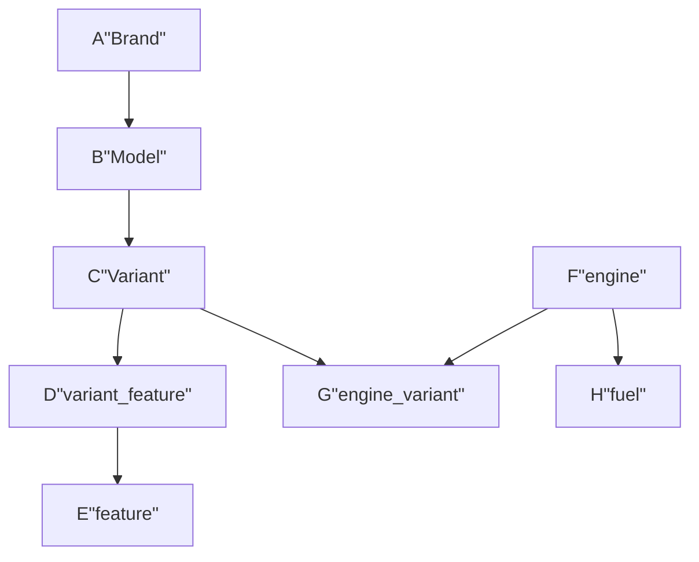

<h1>Vehiclebd</h1>

<h3>Description</h1>

Con estas tablas, puedes organizar la informacion de los vehîculos que se encuentran en fábrica por: Modelos, Variantes, Features y Motor. Los mismos por el momento no tendran un campo llamado "Year" hasta que encuentre la razon para colocarlo en la tabla. 
La relación entre las tablas se establecen mediante las claves PK y FK, permitiendo una gestion eficiente de la información y consultas relacionades.

Here is a simple flow DER:

